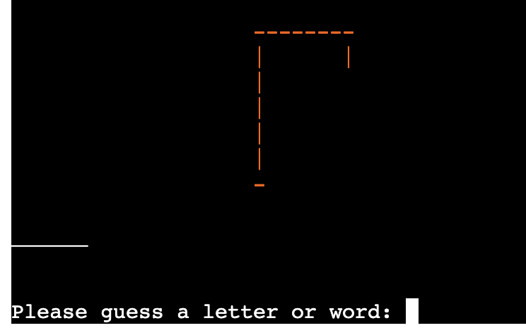
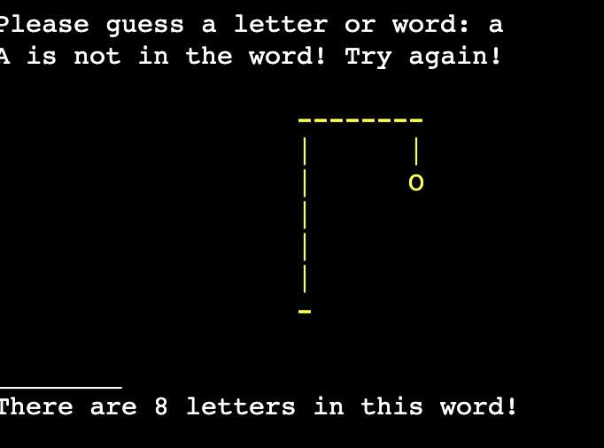

# Console Hangman

## Introduction
Console hangman is the classic game of hangman but it is played in the console.
The aim is to guess the word in six tries. If the user guesses the word is less than 6 tries, they win the game. If the user does not guess the word, it is game over. The user is then asked if they would like to play again.
Each failed guess more and more features of a stick figure would appear on the gallows until it is complete.

The game can be found [here](https://console-hangman.herokuapp.com/)

## Planning Stage 
### Target Audience 
- This game is for people any age
- English speakers
- English students
- Users who want to kill a little time by completing a word game instead of being on social media.

### User Stories
- As a user, I would like to know how to play the game.
- As a user, I would like to know the answer at the end of the game if i get it incorrect.
- As a user, I would like to know how many letters there are in the word I have to guess.
- As a user, I would like to play the game as many times as I want.

### Site Aims
- To provide a game thay runs smoohtly with no errors
- To provide a game that has clear instructions for the user to understand.
- To encourage people to spend less time on social media and to train their brain more.
- To provide quick but challenging gaming.

### Page Layout
The game is layed out on a mock terminal on a webpage deployed on [Heroku](https://www.heroku.com/) and is connected through [GitHub](https://github.com)
The user types in their inputs in the console and presses enter to submit them. 

## Game Walkthrough
- The start image title is from the Ascii graffiti generator [PatorJK](http://patorjk.com/software/taag/#p=testall&f=Stop&t=Console%20Hangman). I made sure the style was readable as some types of graffiti are difficult to read.

- The game asks the user to input a letter or word to start the game. The gallows and the word length are visable above the text

- The user chose the lettet 'a'. The game tells the user that the letter 'a' is not in the word. Below this is the gallow changed colour and the stock figure head has appeared on the gallows. This means that the 6 tries that the user has started with, has gone done to 5. The game also tells the user that the word they are trying to guess contains 8 letters.

- 

