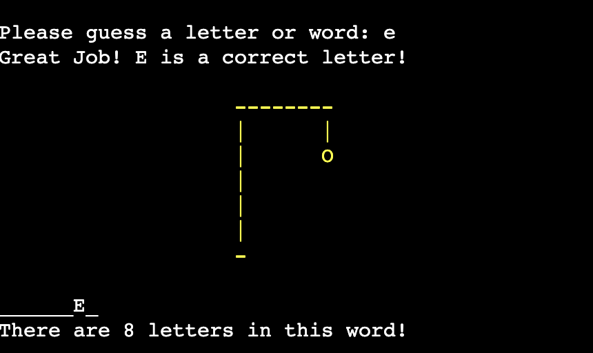
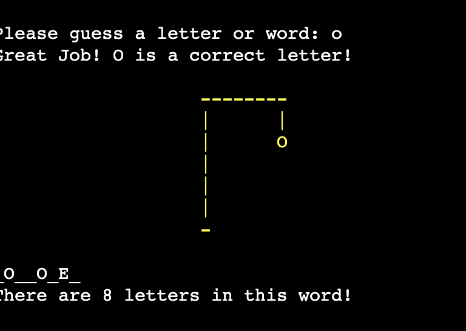
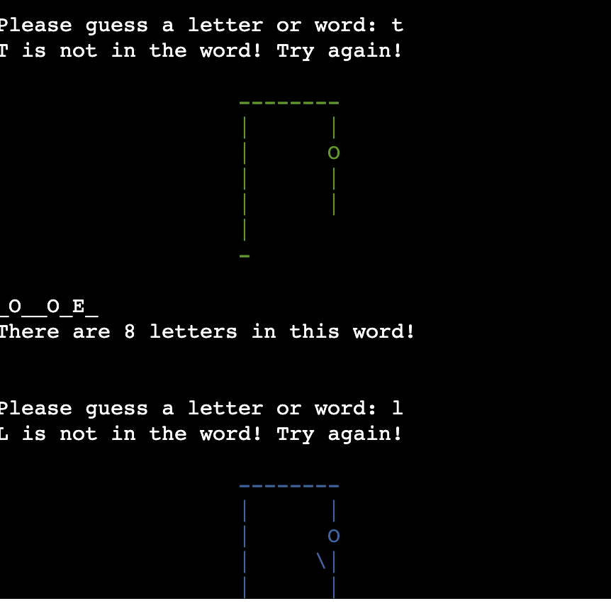
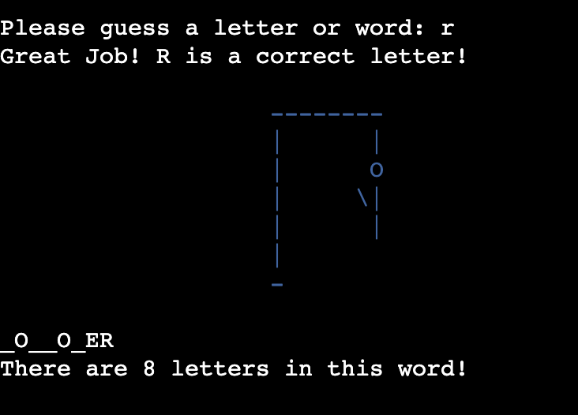
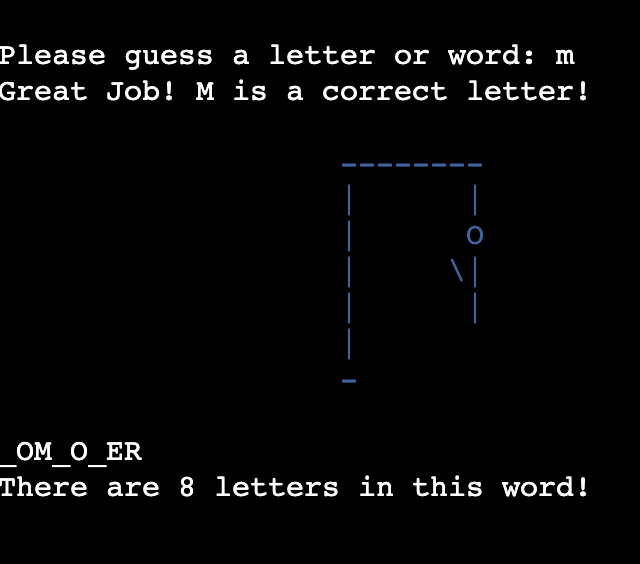
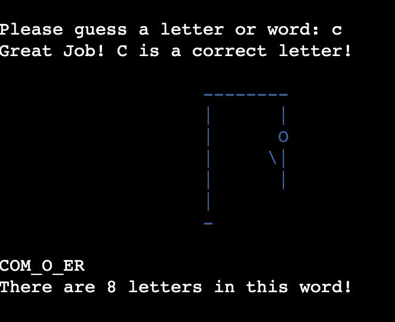

# Console Hangman

## Introduction
Console hangman is the classic game of hangman but it is played in the console.
The aim is to guess the word in six tries. If the user guesses the word is less than 6 tries, they win the game. If the user does not guess the word, it is game over. The user is then asked if they would like to play again.
Each failed guess more and more features of a stick figure would appear on the gallows until it is complete.

The game can be found [here](https://console-hangman.herokuapp.com/)

## Planning Stage 
### Target Audience 
- This game is for people any age
- English speakers
- English students
- Users who want to kill a little time by completing a word game instead of being on social media.

### User Stories
- As a user, I would like to know how to play the game.
- As a user, I would like to know the answer at the end of the game if i get it incorrect.
- As a user, I would like to know how many letters there are in the word I have to guess.
- As a user, I would like to play the game as many times as I want.

### Site Aims
- To provide a game thay runs smoohtly with no errors
- To provide a game that has clear instructions for the user to understand.
- To encourage people to spend less time on social media and to train their brain more.
- To provide quick but challenging gaming.

### Page Layout
The game is layed out on a mock terminal on a webpage deployed on [Heroku](https://www.heroku.com/) and is connected through [GitHub](https://github.com)
The user types in their inputs in the console and presses enter to submit them. 

## Float Chart

## Game Walkthrough
- The start image title is from the Ascii graffiti generator [PatorJK](http://patorjk.com/software/taag/#p=testall&f=Stop&t=Console%20Hangman). I made sure the style was readable as some types of graffiti are difficult to read.
.

- The game asks the user to input a letter or word to start the game. The gallows and the word length are visable above the text

- The user chose the lettet 'a'. The game tells the user that the letter 'a' is not in the word. Below this is the gallow changed colour and the stock figure head has appeared on the gallows. This means that the 5 wrong tries that the user has started with, has gone done to 4. The game also tells the user that the word they are trying to guess contains 8 letters.

- The user than chose the letter 'e'. As soon as they submitted the letter into the game, the game told them that their chosen letter was part of the word. It congratulates the player and adds the letter to the word. The gallows ares still yellow and no extra features have been added. Indicating that the user still has 4 wrong tries left.

- Next, the user chose the letter 'o'. This letter is also in the mystery word. The game adds the correct letter to the word. As you can see the word contains two o's. The user still has 4 wrong tries left.

- The player gets the next two guesses wrong, the gallows change colour twice and a torso and one arm are added to the stick figure, indicating that the user has lost 2 tries. They now have two wrong tries left.

- The player guessed three correct letters in a row. 'r', 'm' and 'c'. There are added to the mustery word. The player still has two worng tries left.

- The user then chose another word, but this time, they forgot they are already chosen that letter. The game tells them that the letter has already been guessed before. This try does not count as an incorrect try. The user still has 2 wrong tries left.

- The user then tried their luck and went to guess the word. They input the word 'composer'. As soon as the user pressed enter, the game told them that they had entered the correcr answer and that they have won the game! A graffiti text of 'Well Done' also indicates this. The user is then asked if they would like to play again. Pressing 'Y' for yes starts the game again. While pressing 'N' ends the game..

- The user played the game again. But this time, they did not manage to guess the word and ran out of tries.
All of the stick figure's limbs were added and a bloody graffiti text appears that says 'Game Over'. The game also tells the user what the mystery word was, then asks the user if they wish to play again.

## Testing
### Pep8 Testing
- I tested my code using a package called [Pycodestyle](https://pypi.org/project/pycodestyle/) as [pep8online](http://pep8online.com/) was down. I only had a few minor things that needed sorting out.

- Lines were too long. The validator thought my lines of Python were too long. To fix this, I just added the excess code to another line.

- Next, I saw that some red squiggles under a function. It was not spaced properly and it had be clear of the code above it by two spaces. I corrected this.

### Bugs

## Techologies 

## Deployment

## Credits and References