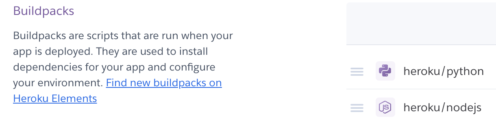

# Console Hangman

## Introduction
Console hangman is the classic game of hangman but it is played in the console.
The aim is to guess the word in six tries. If the user guesses the word is less than 6 tries, they win the game. If the user does not guess the word, it is game over. The user is then asked if they would like to play again.
Each failed guess more and more features of a stick figure would appear on the gallows until it is complete.

The game can be found [here](https://console-hangman.herokuapp.com/)

## Planning Stage 
### Target Audience 
- This game is for people any age
- English speakers
- English students
- Users who want to kill a little time by completing a word game instead of being on social media.

### User Stories
- As a user, I would like to know how to play the game.
- As a user, I would like to know the answer at the end of the game if i get it incorrect.
- As a user, I would like to know how many letters there are in the word I have to guess.
- As a user, I would like to play the game as many times as I want.

### Site Aims
- To provide a game thay runs smoohtly with no errors
- To provide a game that has clear instructions for the user to understand.
- To encourage people to spend less time on social media and to train their brain more.
- To provide quick but challenging gaming.

### Page Layout
The game is layed out on a mock terminal on a webpage deployed on [Heroku](https://www.heroku.com/) and is connected through [GitHub](https://github.com)
The user types in their inputs in the console and presses enter to submit them. 

## Float Chart

## Game Walkthrough

- The start image title is from the Ascii graffiti generator [PatorJK](http://patorjk.com/software/taag/#p=testall&f=Stop&t=Console%20Hangman). I made sure the style was readable as some types of graffiti are difficult to read.

- The games asks the user to select a difficulty. The user selects the difficulty by entering E (Easy), M (Medium) or H (Hard).
The difficulties have the same words to guess but with a different number of tries, 8, 6, 4 respectively.
Our user picked easy, because she is not very good at playing hangman...
If the user enters a letter that is not a difficulty, the game tell them this.

- The player starts by picking the letter 'A'.
When she enters the letter, the game tells her that 'A' is in the word and adds it to the mystery word.
It also tells the user that in this word, there are seven letters.

- The player then inputs her next chosen letter, 'E'. It's not in the word.
The game tells them this and adds the first part on the hangman's gallows, that also change colour for visual effect and to make it obvious that something has been added to it. The user has lost a try.

- The player then guesses two correct answers, 'I' and 'S'. These are added to the word and no tries are lost.

- The player got the next 3 letters incorrect . The letters 'P', 'B' and 'L'are not in the word and three more tries are lost, adding more parts to the hangman and changing it's colour each time.

- The user tried entering 'S' again, but forgot that they already inputed in this letter. They player does not lose a life, but the game tells them that they have repeated the letter.

- The user guessed the letter 'W but it was wrong! They are running out of lives? Will they win?

- The player has the option to cheat! But it costs one try each time they do this. To enter cheat as a word, a random unchosen letter appears in the mystery word and the a try is taken. The game tells the player that they are a cheater! 

- The player adds the letter 'N' it is correct.

- The player, now panicking she has two wrong tries left, uses all her brain to guess the mystery word from the shown letters! She thought she was so clever guessing the word 'basking' (forgetting she was told earlier that the letter 'B' was not in the word but we will let her off.. she was on her work lunch break enjoying a large vanilla latte). It obviously was not the correct word, so she lost a try. She has only one wrong answer left before game over. If she was silly enough to enter the same word again, she would not have lost a life. The game would have told her she already guessed that word.

- The player guessed the word 'masking'. It was the correct word!! (Wahoo!) The game shows the completed word and tells the player well done in a graffiti font. The game asks if the player would like to play again. The player can enter 'Y' for yes and the game starts all over again with aanother random word and 'N' for No which ends the game.

- The user played the game again. But this time, they did not manage to guess the word and ran out of tries.
All of the stick figure's limbs were added and a bloody graffiti text appears that says 'Game Over'. The game also tells the user what the mystery word was, then asks the user if they wish to play again.

## Testing
### Pep8 Testing
- I tested my code using a package called [Pycodestyle](https://pypi.org/project/pycodestyle/) as [pep8online](http://pep8online.com/) was down. I only had a few minor things that needed sorting out.

- I had some lines were too long. The validator thought my lines of Python were too long. To fix this, I just added the excess code to another line.

- Next, I saw that some red squiggles under a function. It was not spaced properly and it had be clear of the code above it by two spaces. I corrected this.

### Manual Testing
- Implementation: At the start of the game, the user selects the difficulty by entering 'E' for easy, 'M' for medium or 'H' for Hard. These three letters should be the only letters that allows the user to carry on with the game has it tells the game how many tries the user would like.
- Test: To test this, I input the 'E', 'M' and 'H' individually. I then tried to input other letters and words. I then added numbers and puncuation marks to see if it stopped the user from continuting.

- Result: Adding anything but 'E', 'M' or 'H' did not continue the game. It tells the user that whatever they inputted is not a difficulty.
- Verdict: Only the letters 'E', 'M' or 'H' selected the difficulty and continued with the game. So it was a success.

-------------------------------------------------------------------------------------------------------------------------------------------

- Implenmentation: Making sure the user can only enter words that have the same number of letters that they are trying to guess and singular letters. The game should not continue if the users input contains any numbers, puncuation marks or any words has more or less than the word being guessed.
- Test: I started the game, selected a difficulty and inputed words with numbers, words with puncuation marks and symbols and words that had more and less words than the guessed word.
- Result: The game did not allow the user to add the wrong type of words and letters in the input section. It told the user why their input was incorrect.
- Verdict: Only adding letters and words with the correct amount of letters carrired on with the game. So this was a success. 

-------------------------------------------------------------------------------------------------------------------------------------------

- Inplenmentation: When the user accidently plays a word / letter that has already been guessed, they do not lose a try.
- Test: Playing a game and duplicating different letters and words (that have the same number of letters that the mystery word has).
- Result: The game pops up telling the user that they have already inputted that letter or word. No extra try has been lost.
- Verdict: This was a success with no extra try and the infomation message telling the user what has happened appears.

-------------------------------------------------------------------------------------------------------------------------------------------

- Inplenmentation: When the user is stuck, they can type the word 'cheat' in the input, the user is given a letter to the mystery word in exchange for a life.
- Test: I played a game and wrote cheat in the input and a letter appeared and a try was taken. I found a few letters using my brain power so most of the letters were filled in. I tried cheat again and a new letter appeared and took away a try.
- Result: When the user types cheat, it always adds a new letter and always takes away a try.
- Verdict: I feel that this is a success but it is very easy for the user to win by inputting cheat in every time. But I trust the users has morals and not take advantage of this...

-------------------------------------------------------------------------------------------------------------------------------------------

- Inplenmentation: When the user wins the game a graffiti image that says "Well Done" appears.
- Test: By winning as many games as I could. Seeing if the image popped up at the right place each time.
- Result: Everytime the last letter of the mystery word was revealed, the image 'Well Done' popped up.
- Verdict: It was a success. The process after I put in the final word was predictable.

-------------------------------------------------------------------------------------------------------------------------------------------

- Inplenmentation: When the user loses the game a graffiti image that says "Game Over" appears.
- Test: By loseing as many games as I could. Seeing if the image popped up at the right place each time.
- Result: Everytime the last try was lost, the image 'Game Over' popped up.
- Verdict: It was a success. The process after losing the fianl try was predictable.

-------------------------------------------------------------------------------------------------------------------------------------------

- Implenmentation: When the user finishes the game whether they win or lose, the game asks them if they would like to play again. To answer the question, the user can input 'Y' for yes and it starts the game again or any other letter for no and the game will end.
- Test: By finishing the game many times and restarting it using 'y' or any other letter at the end.
- Results: When I finish a game, I inputted 'y' for yes and the game restarted. When I press 'n' the game ended.
- Verdict: It was a success, pressing yes restarts the game, pressing no ends the game.

### Bugs
- Cause: the graffiti title was too long for the game area, so half of it was hidden.
- The graffiti length was too long
- Resolution: To solve this, I moved the word 'Hangman' it was below the word 'Console'.

## Techologies 
### Languages
- [Python](https://www.python.org/): Everythong for this project is in Python.
- [Markdown](https://www.markdownguide.org/basic-syntax/): This read me is in Markdown

### Developer Environment
- [GitHub](https://github.com/): Code hosting platform 
- [Visual Studio Code](https://code.visualstudio.com/): This project was written in VS Code
- [Heroku](heroku.com): Cloud platform, deploys the app

### Packages
- [PypiColored](https://pypi.org/project/colored/) To create the colours for the gallows and graffiti text 
- [PypiPep8](https://pypi.org/project/pep8/) To test the Python code I wrote for any errors / imperfections.

### Other
- [Graffiti](https://patorjk.com/software/taag/#p=display&f=Graffiti&t=Type%20Something%20) For the 'Well Done' and 'Game Over' text, I used Patorjk.
## Deployment
- I had commited and pushed everything required for the game to work to GitHub.
- I then went to [Heroku]((heroku.com)) and created an account.
- I click on 'New' on the top left of the site and clicked 'Create New App'.
- I chose the Europe region and created a name for the app. I chose Console-Hangman
- I went to the settings page and sorted out Buildpacks for everythong to work. I inouted the Python and Node buildpacks like so:

- I also input a config var for PORT = 8000.
 
- I clicked on the deploy page and link my GitHub repository with the Heroku app.
- I scrolled tpo the bottom of the page and deployed the branch, looking at all the steps the computer went through to see iof any errors occured.
- I then enabled automatic deploys so every time edited the code and pushed to GitHub, Heroku redeployed the updates automatically.
- I then opened the game on Heroku to check for any errors that may have occured.

## Credits and References
- I watched this YouTube video from a channel called [Kite](https://www.youtube.com/watch?v=m4nEnsavl6w) to help me get the basics of what I needed for the game of hangman to work, pausing it every so often and printing things to understand more of what what happening and why.
- [Hangman Steps and Words](https://github.com/kiteco/python-youtube-code/blob/master/build-hangman-in-python/hangman.py) I used Kites repository to use their hangman steps because I know nothing about making a drawing out of symbols and adapted it to make it look better more like a stick figure. I also used their words as I felt they had a good mixture of easy, difficult, long and short words.
- Rich my mentor. He is cool.
- My partner [Ashleigh](https://github.com/bashleigh) for putting up with me and doing her very best to answer all my questions.